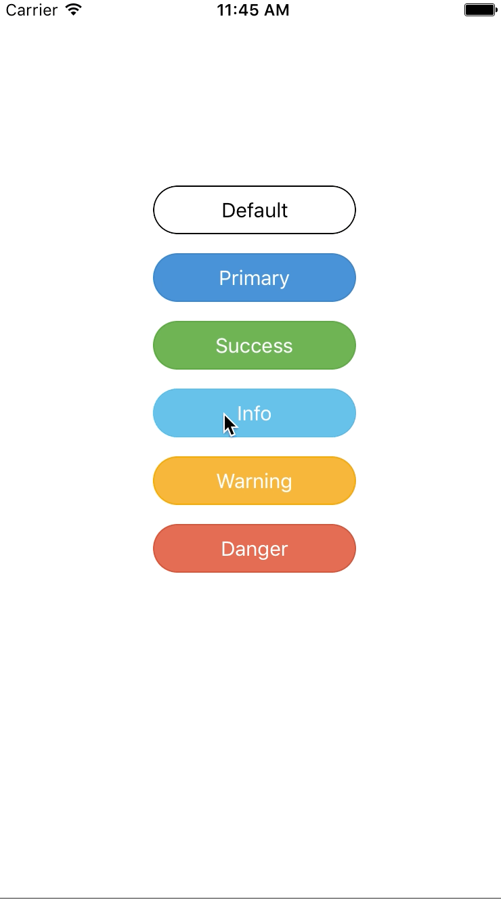

# PPButton
swift button, click on the dynamic effects

## Features



## Usage

```swift
import PPButton

let defaultBtn = PPButton(frame: CGRectMake(115, 140, 150, 36), ppButtonType: .PPBDefault)
defaultBtn.setTitle("Default", forState: .Normal)
self.view.addSubview(defaultBtn)
